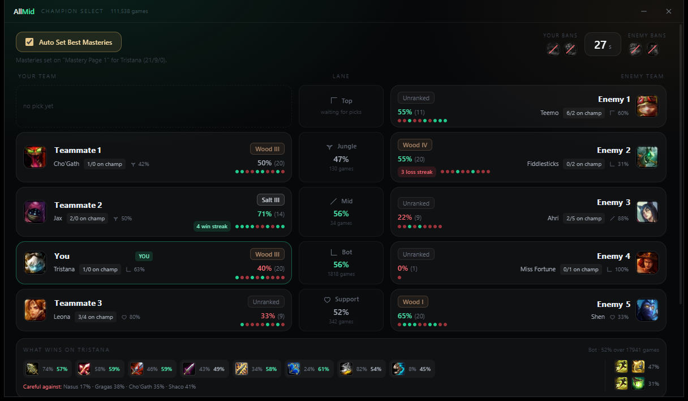
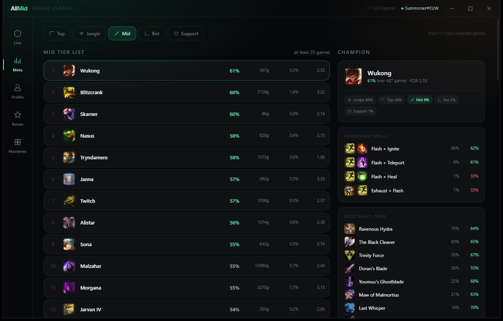

# AllMid

Stats, champion select scouting and build data for **League of Legends Classic** —
the mode no existing tool supports.

**[allmid.gg](https://allmid.gg)** &nbsp;·&nbsp; [Download](https://github.com/allmidgg/desktop/releases/latest) &nbsp;·&nbsp; [Report a bug](https://github.com/allmidgg/desktop/issues)

---

## Why this exists

Open Blitz, Porofessor, Mobalytics or OP.GG during a League Classic game and you get
nothing. Not because it is impossible, but because they all filter on `mapId` 11/12 and
`gameMode: CLASSIC`. League Classic runs under a different name on a different map, so it
falls through every filter. Riot's public API does not expose the mode at all — we
verified this: every Classic match returns `403 Forbidden`, and every Classic queue filter
returns zero results.

So AllMid reads the League client directly, the same way Blitz and Porofessor do, and
builds its own dataset from what it finds.



*Champion select, lane by lane: who is against whom, their rank and form, their record on
that champion, the matchup winrate, and what wins on your pick.*

## What we found

League Classic is called **`JADE`** internally.

| | |
| --- | --- |
| Game mode | `JADE` |
| Map | `453` — "Classic Rift" |
| Queues | `3260` / `3262` normal, `4310` ranked solo, `4320` bots |
| Ranked queue | `JADE_RANKED_SOLO_5x5` |
| Ranks | its own ladder — **Wood**, **Salt**, ... not Iron to Challenger |

Champions and items live in separate ID spaces so the classic and modern versions can
coexist:

| Type | Formula | Example |
| --- | --- | --- |
| Champion | `60000 + baseId` | Ashe `22` becomes `60022`, alias `Jade_Ashe` |
| Item | `770000 + baseId` | Infinity Edge `3031` becomes `773031` |
| Summoner spell | `"7" + baseId` | Flash `4` becomes `74`, Teleport `12` becomes `712` |

The client serves the names and icons for all of it: 63 champions, 162 items, the full
three-tree mastery system and 59 runes. `src/core/jade/catalog.ts` builds the catalogue
from those files and **validates the formulas against them**, so if Riot ever changes the
convention you get a warning instead of silently wrong data.

---

## Is this safe to run?

Fair question to ask of any executable that talks to your game client. The honest answer:

**What it does**

- Reads the **League Client API** (LCU) — the local HTTPS server your own client runs.
  This is the same interface Blitz, Porofessor and OP.GG's desktop app use.
- Reads the **Live Client Data API** on port 2999 during a game, for skill order.
- Writes your rune and mastery pages, but **only when you ask it to**, and it saves a
  backup of your loadout first.

**What it does not do**

- No memory reading. No injection. No DLLs. No hooking the game process.
- No scripting, no automation of gameplay, nothing that touches the game itself.
- No account credentials. It never sees or asks for your password — the client
  authenticates itself and AllMid talks to it locally over `127.0.0.1`.

**Why you can check this yourself**

The whole thing is open source. Every request it makes to your client is in
`src/core/lcu/`. You can also build it yourself (see below) and compare — the release
binaries come from the GitHub Actions workflow in this repo, not from someone's laptop.

---

## Install

Download the latest installer from [Releases](../../releases). Two builds are published:

- **Setup** — normal installer, installs to `%LOCALAPPDATA%` (no admin rights needed)
- **Portable** — single `.exe`, no installation

> **Windows SmartScreen** may warn on first run. Signing is in progress; until a release
> has enough downloads to build reputation the warning appears for everyone. If that
> bothers you, build from source — the instructions below produce the same binary.

## Build from source

Requires Node 20 or newer and a Windows machine.

```bash
npm install
npm run build          # the AllMid client
npm run manager:build  # the server manager
npm run manager:package
```

The installers land in `manager/dist/`.

---

## The apps

### AllMid client

| Screen | What it shows |
| --- | --- |
| **Live** | Your current status and recent Classic games with items, spells and KDA |
| **Champion select** | Opens as its own window the moment select starts. Per lane: who is against whom, their rank and winrate, their record on that champion, their usual role, the matchup winrate and the best counters |
| **Meta** | Tier lists per lane, and per champion the builds, summoner spells and matchups |
| **Profile** | Your own numbers, plus a search box for any player |
| **Runes / Masteries** | The classic 30-point mastery trees, and rune suggestions from what you actually own |



Auto Set Best Masteries is a checkbox: leave it on and your mastery page follows whichever
champion you pick, including when you switch mid-select.

### Server Manager

A separate desktop app that hosts the collection servers for every game helper — not just
League. All services run on **one port** with path routing (`/lol-classic/...`, `/auth/...`),
and each one can be started, paused, resumed and stopped independently while the host keeps
running. It also browses and edits the collected data directly.

Adding a game means writing one service file and registering it. No extra port, no extra
process.

---

## How the data works

There is no public dataset for this mode, so the app builds one. Every game it encounters
is reduced to the fields that matter statistically and appended as one line of JSON.

Each game contains ten players, and each player leads to more games — so the crawler walks
that network outward from your own account. It holds back deliberately: one request at a
time, and never while you are in champion select or in a game.

```bash
npm run crawl          # runs until you stop it
npm run stats          # tier lists from what you have
npm run stats -- Ashe  # everything known about one champion
```

**What is stored per player:** puuid, champion, team, position, result, KDA, CS, gold,
final items, summoner spells. **What is not:** names (looked up live when needed), runes
and masteries (Riot does not record them for this mode), and item purchase order (the match
data only contains the final inventory, so we do not pretend to know the order).

Games shorter than five minutes are dropped — remakes distort everything.

### Sharing

The client can send what it finds to a shared server so the dataset grows for everyone.
That is a **checkbox you can turn off**, and the first run explains what gets sent. Only
game IDs the server does not already have are uploaded, so overlapping users cost nothing.

---

## Contributing

Issues and pull requests are welcome. A few things worth knowing:

- Code comments are currently in Dutch; user-facing strings are English.
- `npx tsc --noEmit` must stay clean — both apps share `src/core`, so a change there
  affects everything.
- The storage layer (`src/core/services/matchStore.ts`, `manager/src/main/data/`) is where
  data can genuinely be lost. It is deliberately careful and heavily commented; read those
  comments before changing anything there.

## License

MIT — see [LICENSE](LICENSE).

Not endorsed by Riot Games. League of Legends and Riot Games are trademarks or registered
trademarks of Riot Games, Inc.
